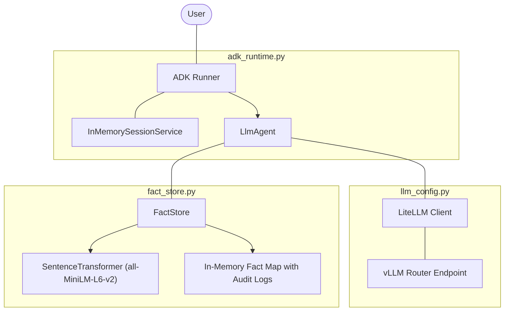
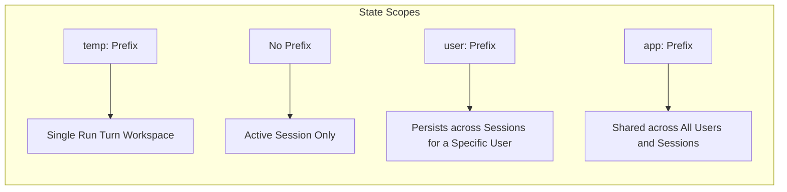
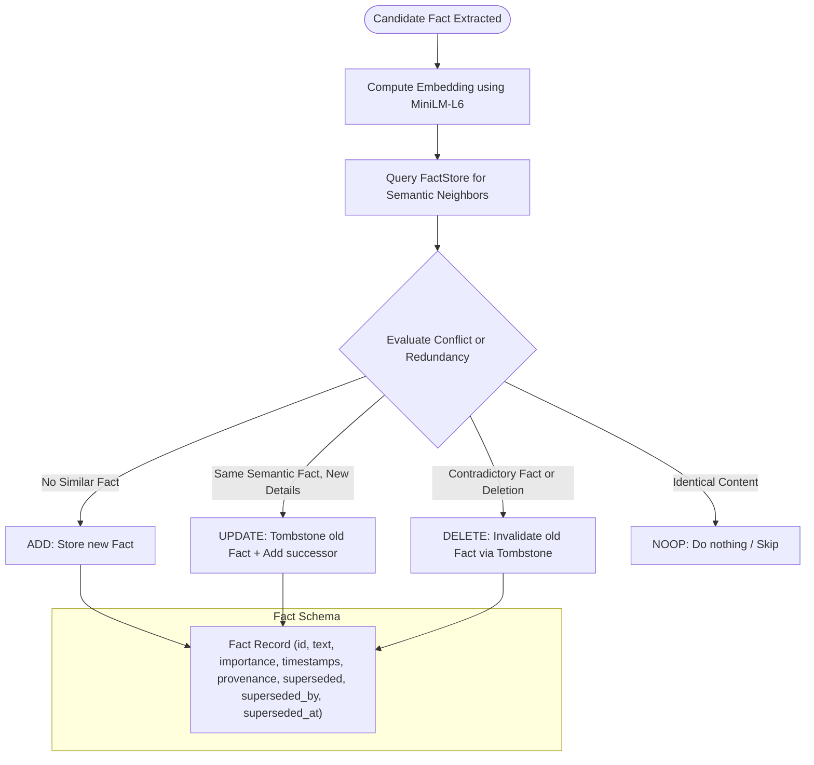
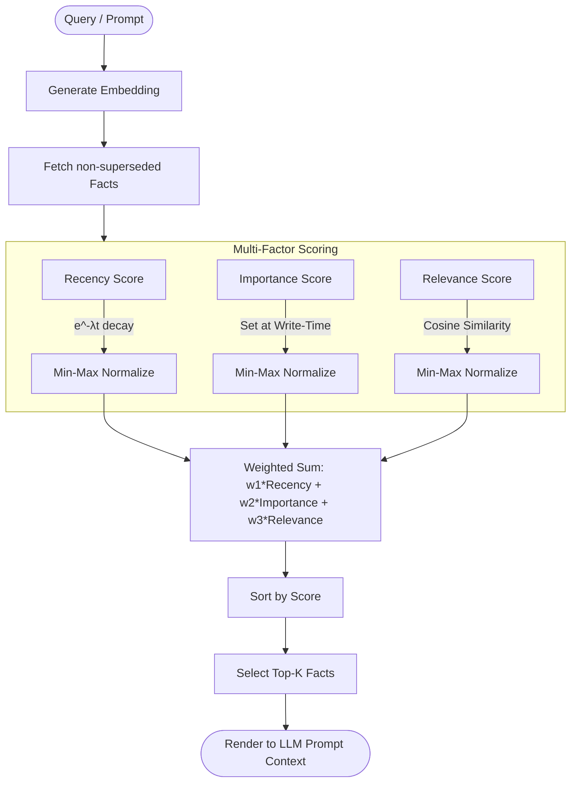
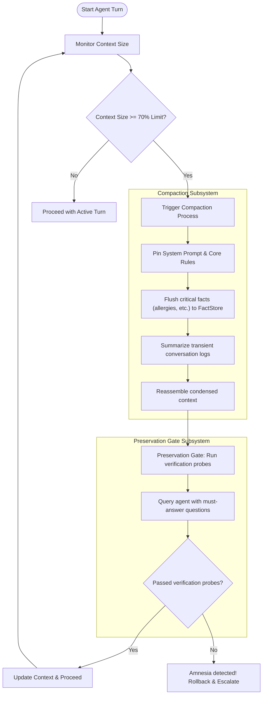
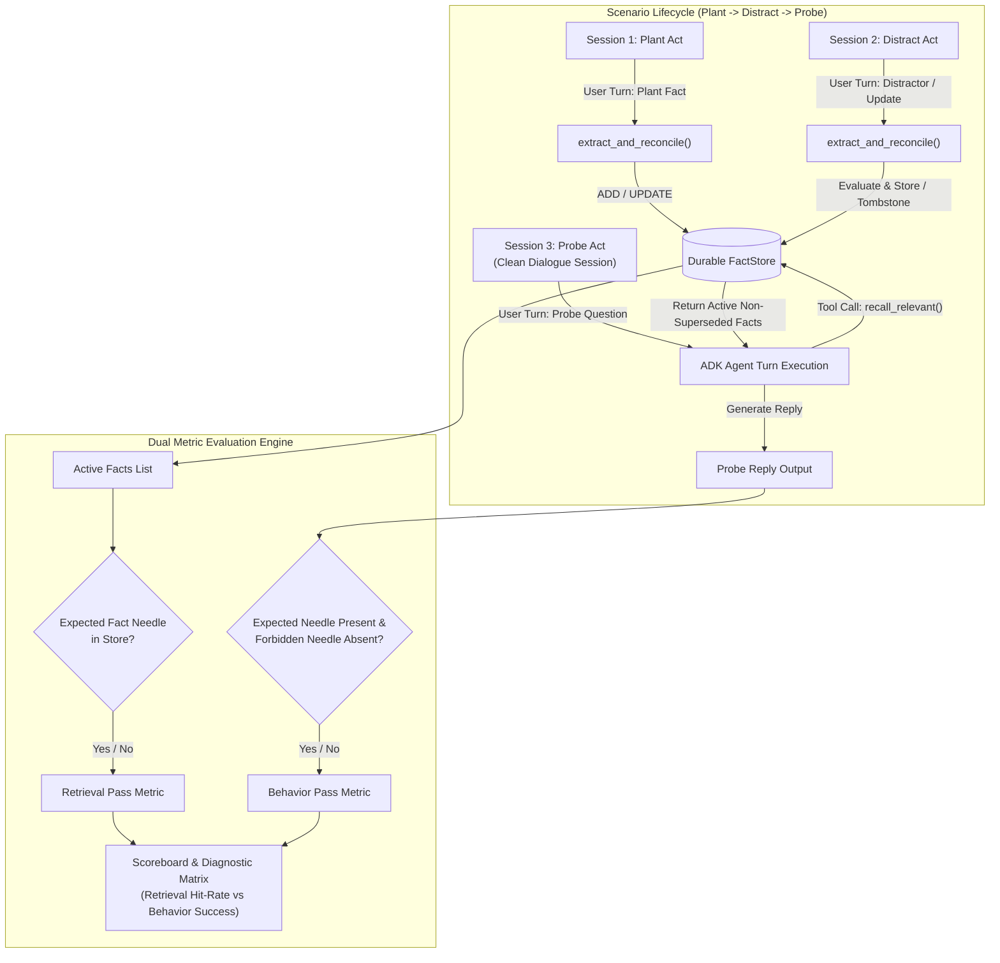
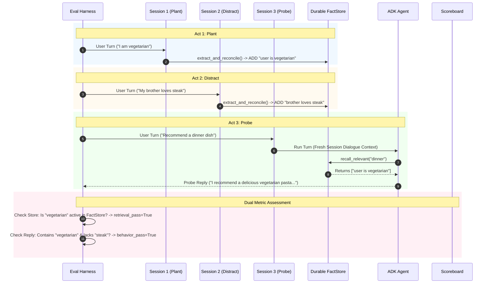
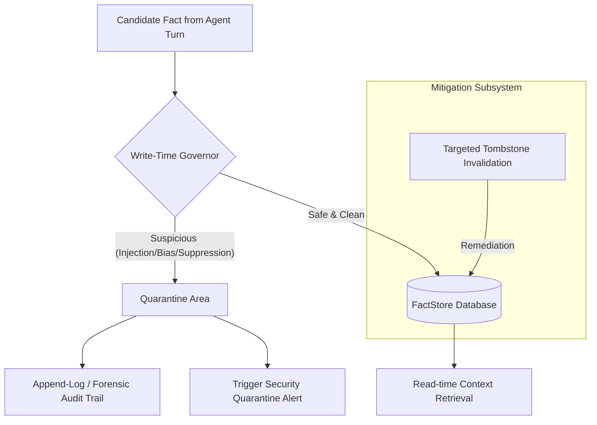

# Agent Memory System Architecture

This document details the software architecture, core components, and data flows of the **Agent Memory Labs** built with the Google Agent Development Kit (ADK). The architecture is designed to address complex memory challenges: scope management, write-time reconciliation, multi-factor retrieval scoring, context compaction gates, behavioral evaluation (plant → distract → probe), and memory-time governance.

---

## 1. System Component Overview

The diagram below shows the high-level components of the application. The system decouples **transient context (ADK session state)** from **durable memories (FactStore)**.

---

## 2. Memory Scoping & Storage Architecture

When the agent writes to the store, it tags variables and facts with specific scopes using state prefixes. The scopes determine the longevity and visibility of the data:

- **`temp:`**: Workspace for intermediate reasoning (e.g. scratchpad). Cleared as soon as `run_turn` finishes.
- **Session (no prefix)**: Stored in the active session. Dies when the session ends.
- **`user:`**: Persistent user preferences. Survives session termination and is re-loaded when the same `user_id` starts a new session via `InMemorySessionService`.
- **`app:`**: Global application-wide states or configurations shared by all users.

---

## 3. Write-Policy & Reconciliation Pipeline (Lab 02)

Every memory write is a **reconciliation process**, rather than a blind insert. This pipeline prevents redundant facts, cleans up outdated state, and maintains audit trails.

- **Tombstones**: Instead of hard deleting, invalidated facts set `superseded = True` and link to their replacement via `superseded_by` for full audit trail tracing.

---

## 4. Memory Stream Retrieval Pipeline (Lab 02b)

Retrieval computes a multi-factor score instead of a raw cosine-similarity nearest-neighbor search. This prevents recent small chatter (e.g., "likes tea today") from overriding critical cold facts (e.g., "severe peanut allergy").

---

## 5. Compaction & Preservation Gate (Lab 03)

As the context window fills, memory must be compressed. Compaction summarizes historical turns but introduces the risk of **amnesia**. The preservation gate acts as a safety unit test.

---

## 6. Behavioral Memory Evaluation Pipeline (Lab 04)

Evaluating memory requires separating **retrieval metrics** (did the fact surface into context?) from **behavioral metrics** (did the agent act on the fact correctly?). A scenario follows a three-act lifecycle (**Plant → Distract → Probe**) across isolated sessions while sharing durable memory.

### Multi-Session Evaluation Sequence

- **Retrieval Floor vs. Behavioral Success**: Retrieval@k measures if the plumbing brought the fact to prompt context. Behavioral success measures if the agent followed instructions and acted on the fact.
- **Diagnostic Rule of Thumb**: If `retrieval_pass=True` but `behavior_pass=False`, the bug lies in instruction following or prompt interference rather than storage.

---

## 7. Write-Time Memory Governance (Lab 05)

When agents write memories based on external tools, user input, or web documents, they are exposed to **indirect prompt injection** (poisoned memories). The governor serves as a gatekeeper.

- **Quarantine**: Instead of silently dropping toxic instructions (which makes debugging hard), facts are quarantined with metadata details, allowing developers to trace the source of the prompt injection.

