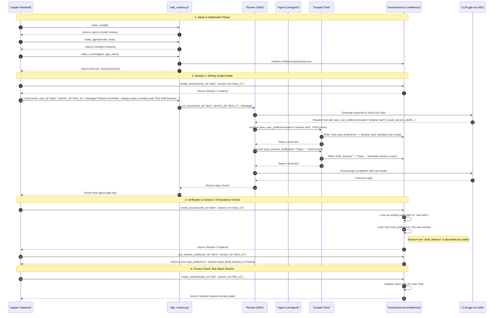

# Scoped Store Notebook Sequence Diagram

This document illustrates the sequence of operations executed in the first notebook (`docs/notebooks/01_scoped_store.ipynb`), highlighting how the test harness (`adk_runtime.py`) orchestrates execution, interacts with the Google ADK runner, and manages session scopes using the `InMemorySessionService`.

---

## Sequence Diagram

The diagram below details the initialization, state-writing, state-persistence, and privacy-leak checks.

---

## Detailed Sequence Breakdown

1. **Initialization Phase**:
   - The Jupyter notebook loads environment parameters via `load_lab_env()`.
   - `make_model()` creates the ADK model instance.
   - `make_agent()` registers the scoped Python tools (`save_user_preference`, `save_session_draft`, etc.) with `LlmAgent`.
   - `make_runner()` creates a shared `InMemorySessionService` that manages the database in memory across different session executions.

2. **Session 1 - Alice's Preference Storage**:
   - The notebook calls `run_turn()` inside `adk_runtime.py` which triggers `runner.run_async()`.
   - The LLM identifies the tool definitions and triggers parallel calls:
     - `save_user_preference` sets a `user:seat_preference` key in `ToolContext.state`.
     - `save_session_draft` sets a bare `draft_itinerary` key in `ToolContext.state`.
   - The runtime records these state operations into the shared session service.

3. **Session 2 - User-Level Persistence**:
   - When `create_session()` is invoked for `alice` under a new session ID (`alice_s2`), `InMemorySessionService` recovers keys matching the prefix `user:` for `alice`.
   - State keys without a prefix (bare keys like `draft_itinerary`) are associated strictly with `alice_s1` and are discarded.
   - Assertions verify that `user:seat_preference` persists, whereas `draft_itinerary` is absent.

4. **Privacy Isolation (Bob)**:
   - When a session starts for user `bob`, the service ensures no other user's persistent keys are retrieved.
   - This validates that the `user:` prefix acts as a proper user boundary, preventing data leaks.
